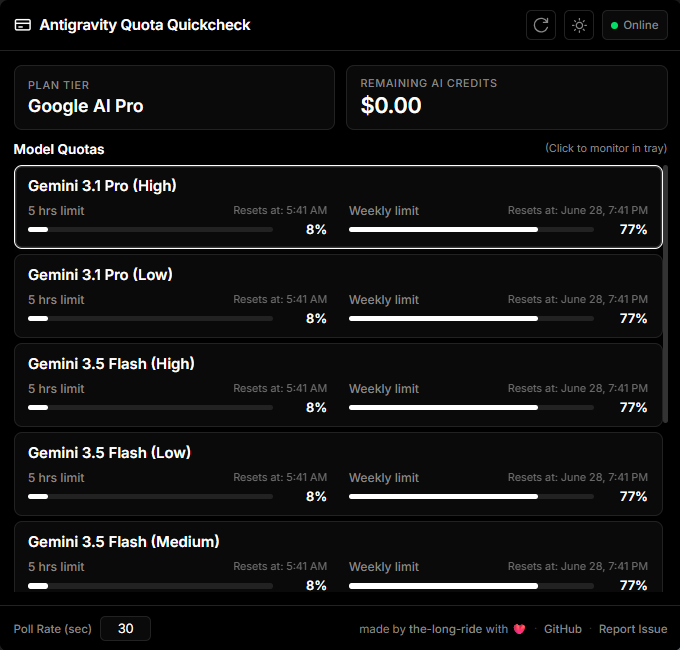

# 💳 Google AI Quota Quickcheck

> **One click. Zero distraction. Full control.**

Monitor your Google AI model quotas, credit balance and most recent used model directly from your VS Code status bar. No more switching tabs to check if you're hitting limits.

---

### ⚡ At a Glance
- **Real-time Tracking**: Live updates for Gemini and other Google AI models.
- **Visual Indicators**: Color-coded battery icons showing remaining capacity.
- **Seamless UI**: Built natively for VS Code—no distraction, just information.

### 📸 Preview
| Hover for Detail | Click to view all Quotas & manual refresh usage |
| :---: | :---: |
|  |  |

### 🚀 Key Features
- **Active Model Monitoring**: Displays the remaining quota of your selected Gemini model directly in the status bar. If no model is explicitly set, it automatically defaults to the model with the highest remaining quota.
- **Rich Hover Tooltip**: Hover for a detailed, borderless HTML breakdown of your subscription tier, remaining AI credits, and model reset times. The active model is highlighted with bold text and a pulse icon **$(pulse)$**.
- **Clean Workspace**: Minimize status bar clutter by clicking "Minimize monitor" in the tooltip to replace the full quota text with a simple `$(credit-card) Quotas` display. Restore it anytime with "Display monitor".
- **Customizable Intervals**: Adjust the quota refresh rate on-the-fly directly from the tooltip settings prompt.
- **One-Click QuickPick**: Click the status bar item to instantly force a refresh and view all models in a clean, searchable QuickPick dropdown. Select any model from the list to update the monitored model.

### 🖥️ Standalone Desktop Tray Application
The project now includes a **Tauri-powered standalone desktop tray application** to keep track of your quotas even when VS Code is closed.

- **System Tray Integration**: A clean tray icon with a tooltip showing remaining credits and active model quota.
- **Floating Dashboard**: Click the tray icon to toggle a premium, lightweight, translucent overlay dashboard.
- **Click-to-Monitor**: Click any model in the dashboard list to set it as the primary model monitored in the system tray.
- **Full Features**:
  - Live API credit balance and detailed quota percentages with progress bars.
  - Custom refresh poll rate (in seconds).
  - Clean light/dark mode theme toggling.
  - Auto-updates directly from GitHub Releases.

### 📦 Installation

#### VS Code Extension
- **Marketplace**: Install via [Open VSX Registry](https://open-vsx.org/extension/the-long-ride/antigravity-quota-quickcheck)
- **Manual**: Download the `.vsix` from releases, then `Extensions: Install from VSIX...` in VS Code.

#### Standalone Desktop App
- **Windows**: Download the [installer (*setup.exe)](https://github.com/the-long-ride/antigravity-quota-quickcheck/releases/latest) or the [portable executable (*portable.exe)](https://github.com/the-long-ride/antigravity-quota-quickcheck/releases/latest) from the [latest GitHub release](https://github.com/the-long-ride/antigravity-quota-quickcheck/releases/latest).
- **Linux**: Download the [.deb package](https://github.com/the-long-ride/antigravity-quota-quickcheck/releases/latest) from the [latest GitHub release](https://github.com/the-long-ride/antigravity-quota-quickcheck/releases/latest).

---

#### 🙏 Credits
Special thanks to [llegomark](https://github.com/llegomark) for the `ag-telemetry` foundation.

---
[Open VSX](https://open-vsx.org/extension/the-long-ride/antigravity-quota-quickcheck) | [GitHub](https://github.com/the-long-ride/antigravity-quota-quickcheck) | [Changelog](CHANGELOG.md) | [MIT License](LICENSE)
