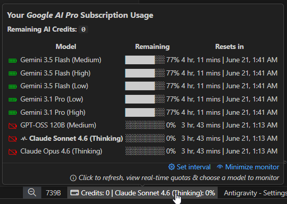
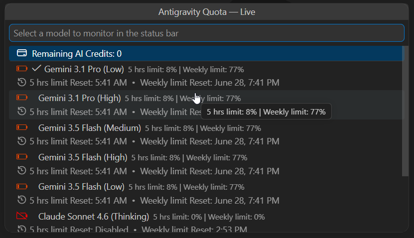

# 💳 Google AI Quota Quickcheck

> **One click. Zero distraction. Full control.**

Monitor your Google AI model quotas and credit balance directly from your VS Code status bar. No more switching tabs to check if you're hitting limits.

---

### ⚡ At a Glance
- **Real-time Tracking**: Live updates for Gemini and other Google AI models.
- **Visual Indicators**: Color-coded battery icons showing remaining capacity.
- **Seamless UI**: Built natively for VS Code—no distraction, just information.

### 📸 Preview
| Hover for Detail | Click for All Quotas |
| :---: | :---: |
|  |  |

### 🚀 Key Features
- **Smart Status Bar**: See your active model's quota percentage instantly.
- **Rich Dashboards**: Hover for a detailed breakdown of credits and reset times.
- **Customizable Refresh**: Adjust the polling interval via the status bar or tooltip settings.
- **One-Click QuickPick**: Instant access to all model stats in a clean, searchable list.

### 📦 Quick Start
1. Open **Extensions** (`Ctrl+Shift+X`).
2. Click `...` > **Install from VSIX...**
3. Select your `.vsix` file and restart VS Code.

---

#### 🙏 Credits
Special thanks to [llegomark](https://github.com/llegomark) for the `ag-telemetry` foundation.

---
[GitHub](https://github.com/the-long-ride/antigravity-quota-quickcheck) | [Changelog](CHANGELOG.md) | [MIT License](LICENSE)
